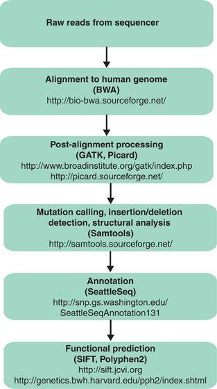

# GWAS_analysis

[Image source](https://www.researchgate.net/figure/Schematic-of-a-bioinformatics-pipeline-Examples-of-the-most-commonly-used-publicly_fig3_250923605)

## *What is Bioinformatics pipeline?*

*Bioinformatics pipelines are used to process large amounts of biological data, such as sequencing data, and to extract meaningful insights from it. The steps involved in a bioinformatics pipeline can vary depending on the specific analysis being performed, but here are some general steps that are typically involved:*

 1. *1.  Quality Control: This step involves assessing the quality of the raw sequencing data to ensure that it meets the required
    standards. Common metrics used to assess the quality of the data
    include sequence length, GC content, and sequencing errors.*
        
    *2.  Read Preprocessing: This step involves trimming adapter sequences, filtering out low-quality reads, and removing any reads
    that align to the host genome or other contaminants.*
        
    *3.  Alignment: This step involves aligning the reads to a reference genome or transcriptome. This can be done using tools sucAR.h as
    Bowtie, BWA, or ST*
        
    *4.  Post-processing: This step involves processing the aligned reads to identify variants or differential gene expression. This can
    include filtering out low-confidence variants, normalizing gene
    expression data, and correcting for batch effects.*
        
    *5.  Annotation: This step involves annotating the identified variants or differentially expressed genes to determine their
    biological relevance. This can be done using tools such as ANNOVAR,
    SnpEff, or VEP.*
        
    *6.  Visualization: This step involves visualizing the results of the analysis using tools such as R, Python, or Tableau.*
        
    *7.  Interpretation: This final step involves interpreting the results of the analysis in the context of the biological question
    being asked. This may involve further experiments to validate the
    findings or generating new hypotheses based on the results.*

*It's important to note that these steps are not always performed in a linear fashion, and some steps may be repeated or omitted depending on the analysis being performed. Additionally, bioinformatics pipelines can be complex and may involve multiple tools and software packages, which can be challenging to set up and maintain. Therefore, it's essential to have a clear understanding of the analysis being performed and to carefully select the appropriate tools and pipelines to use.*

Text was generated using [ChatGPT](https://chat.openai.com/)

Requirements:

 - python 3.8-3.10 
 Scikit-learn, numpy, pandas 
 - Fastp 
 - Samtools 
 - BWA
 - Bcftools

## Step 1(Read Preprocessing)

Put all of your *fastq.gz files to data folder and run:
-     python 1.trim.py

It removes low-quality reads and trims adapter sequences. It also trims reads that are longer than the desired length and filters out reads that are too short and generates reports.

## Step 2(Alignment)

Make sure your data folder contains *trimmed* files and run:
-     python 2.map.py

This command aligns reads to a reference genome and generates .bam files(+.bai files).
*Do not forget to download, index [reference genome](https://www.ncbi.nlm.nih.gov/genome/guide/human/) and change path.*

## Step 3(Variant Calling)

You may have to change permission before running `3.var_call` and make sure configurations meet your requirements. `AN` means Total number of alleles in called genotypes.
Run following command:

-     ./3.var_call

Output is saved in `variants` folder(separate files for `SNPs` and `INDELs`)

## Step 4(Annotation)

Download [dbSNP](https://www.ncbi.nlm.nih.gov/genome/guide/human/) and index(maybe there is easier way, but that's how I did).
Run following command:

-     ./4.annotate_var

Output is saved in `variants` folder(annotates only SNPs not INDELs, you have to do some modifications to annotate INDELs).

## Step 5(Fill Missing Genotypes)

SOON...
